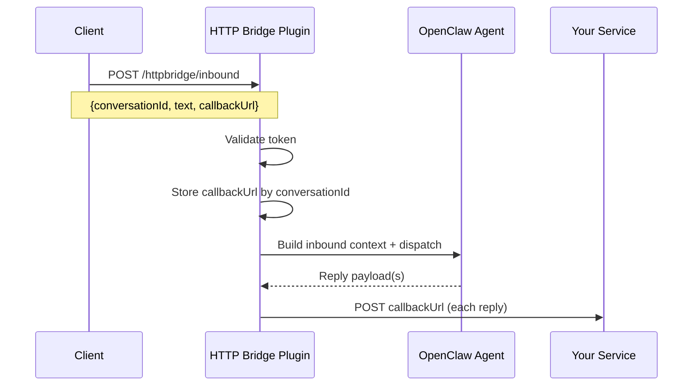

# OpenClaw HTTP Bridge

[English](README.md) | [简体中文](README.zh-CN.md)

HTTP inbound + callback outbound channel plugin for OpenClaw. Send messages to OpenClaw over HTTP, receive every reply via your `callbackUrl`.

## Features

- HTTP webhook ingress (`/httpbridge/inbound`)
- Per-conversation callback routing
- Token-based inbound auth
- Optional callback host allowlist
- Compatible with OpenClaw channel routing/session behavior
- Supports `openclaw channels add` and onboarding wizard

## Install

### npm (recommended)

```bash
openclaw plugins install openclaw-httpbridge
openclaw plugins enable openclaw-httpbridge
```

### Local path (git clone)

```bash
git clone https://github.com/openclaw/openclaw-httpbridge.git
openclaw plugins install /path/to/openclaw-httpbridge
openclaw plugins enable openclaw-httpbridge
```

## Workflow (How it works)



## Configuration

### Option A: `openclaw channels add` (recommended for CLI)

```bash
openclaw channels add --channel httpbridge \
  --token shared-secret \
  --webhook-path /httpbridge/inbound \
  --url http://127.0.0.1:9011/callback
```

### Option B: Onboarding wizard

```bash
openclaw channels add --channel httpbridge
```

The wizard prompts for:
- token
- webhookPath
- callbackDefault
- allowCallbackHosts (optional)

### Option C: Manual config (JSON)

```json
{
  "channels": {
    "httpbridge": {
      "enabled": true,
      "token": "shared-secret",
      "webhookPath": "/httpbridge/inbound",
      "callbackDefault": "http://127.0.0.1:9011/callback",
      "allowCallbackHosts": ["127.0.0.1"],
      "callbackTtlMinutes": 1440,
      "maxCallbackEntries": 10000
    }
  }
}
```

## Configuration reference

| Field | Type | Required | Description |
| --- | --- | --- | --- |
| `enabled` | boolean | no | Enable/disable the channel. |
| `token` | string | yes | Inbound auth token. Requests must include `Authorization: Bearer <token>` or `x-openclaw-token`. |
| `webhookPath` | string | no | Path for inbound webhook. Default: `/httpbridge/inbound`. |
| `callbackDefault` | string (URL) | yes | Default callback URL when inbound payload omits `callbackUrl`. |
| `allowCallbackHosts` | string[] | no | Allowlist for callback hostnames. If set, callbacks to other hosts are rejected. |
| `callbackTtlMinutes` | number | no | TTL for cached `conversationId -> callbackUrl` mapping (default 1440 minutes). |
| `maxCallbackEntries` | number | no | Max cached callbacks before eviction (default 10000). |
| `defaultAccount` | string | no | Default account id when multiple accounts are configured. |
| `accounts` | object | no | Per-account overrides (same fields as above). |

## Usage

### Inbound request

```bash
curl -X POST http://127.0.0.1:18789/httpbridge/inbound \
  -H 'Authorization: Bearer shared-secret' \
  -H 'Content-Type: application/json' \
  -d '{"conversationId":"demo-123","text":"Hello OpenClaw","callbackUrl":"http://127.0.0.1:9011/callback"}'
```

### Inbound payload

```json
{
  "conversationId": "demo-123",
  "text": "Hello OpenClaw",
  "callbackUrl": "http://127.0.0.1:9011/callback",
  "senderId": "user-42",
  "senderName": "Alice",
  "metadata": {"source": "demo"}
}
```

### Callback payload

```json
{
  "conversationId": "demo-123",
  "messageId": "httpbridge-1730000000000",
  "text": "OpenClaw reply text",
  "mediaUrls": [],
  "sessionKey": "httpbridge:demo-123",
  "agentId": "main",
  "timestamp": 1730000000000
}
```

## Security

- Keep the webhook behind a trusted network or proxy.
- Use a strong `token`.
- Restrict `allowCallbackHosts` when possible.

## Development

- Code entry: `index.ts`
- Channel implementation: `src/channel.ts`
- Webhook handler: `src/monitor.ts`
- Onboarding adapter: `src/onboarding.ts`

## License

MIT
