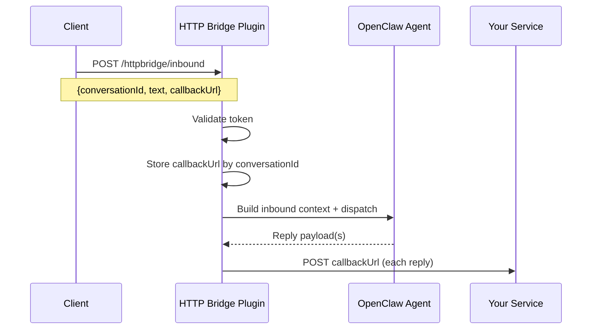

# OpenClaw HTTP Bridge

[English](README.md) | 简体中文

OpenClaw 的 HTTP 入站 + 回调出站通道插件。通过 HTTP 向 OpenClaw 发送消息，并通过 `callbackUrl` 接收所有回复。

## 功能

- HTTP webhook 入站 (`/httpbridge/inbound`)
- 按会话路由回调
- 基于 token 的入站鉴权
- 可选回调主机白名单
- 兼容 OpenClaw 通道路由/会话行为
- 支持 `openclaw channels add` 和引导式配置

## 安装

### npm（推荐）

```bash
openclaw plugins install openclaw-httpbridge
openclaw plugins enable openclaw-httpbridge
```

### 本地安装（git clone）

```bash
git clone https://github.com/openclaw/openclaw-httpbridge.git
openclaw plugins install /path/to/openclaw-httpbridge
openclaw plugins enable openclaw-httpbridge
```

## 工作流（如何运行）



## 配置

### 方式 A：`openclaw channels add`（CLI 推荐）

```bash
openclaw channels add --channel httpbridge \
  --token shared-secret \
  --webhook-path /httpbridge/inbound \
  --url http://127.0.0.1:9011/callback
```

### 方式 B：引导式配置

```bash
openclaw channels add --channel httpbridge
```

引导会提示：
- token
- webhookPath
- callbackDefault
- allowCallbackHosts（可选）

### 方式 C：手动配置（JSON）

```json
{
  "channels": {
    "httpbridge": {
      "enabled": true,
      "token": "shared-secret",
      "webhookPath": "/httpbridge/inbound",
      "callbackDefault": "http://127.0.0.1:9011/callback",
      "allowCallbackHosts": ["127.0.0.1"],
      "callbackTtlMinutes": 1440,
      "maxCallbackEntries": 10000
    }
  }
}
```

## 配置字段说明

| 字段 | 类型 | 必填 | 说明 |
| --- | --- | --- | --- |
| `enabled` | boolean | 否 | 启用/禁用通道。 |
| `token` | string | 是 | 入站鉴权 token。请求需包含 `Authorization: Bearer <token>` 或 `x-openclaw-token`。 |
| `webhookPath` | string | 否 | 入站 webhook 路径。默认：`/httpbridge/inbound`。 |
| `callbackDefault` | string (URL) | 是 | 当入站 payload 未提供 `callbackUrl` 时使用的默认回调地址。 |
| `allowCallbackHosts` | string[] | 否 | 回调主机白名单；设置后，其他主机的回调将被拒绝。 |
| `callbackTtlMinutes` | number | 否 | `conversationId -> callbackUrl` 缓存 TTL（默认 1440 分钟）。 |
| `maxCallbackEntries` | number | 否 | 缓存回调条目上限（默认 10000）。 |
| `defaultAccount` | string | 否 | 多账号配置时的默认账号 ID。 |
| `accounts` | object | 否 | 按账号覆盖配置（字段同上）。 |

## 使用

### 入站请求

```bash
curl -X POST http://127.0.0.1:18789/httpbridge/inbound \
  -H 'Authorization: Bearer shared-secret' \
  -H 'Content-Type: application/json' \
  -d '{"conversationId":"demo-123","text":"Hello OpenClaw","callbackUrl":"http://127.0.0.1:9011/callback"}'
```

### 入站 payload

```json
{
  "conversationId": "demo-123",
  "text": "Hello OpenClaw",
  "callbackUrl": "http://127.0.0.1:9011/callback",
  "senderId": "user-42",
  "senderName": "Alice",
  "metadata": {"source": "demo"}
}
```

### 回调 payload

```json
{
  "conversationId": "demo-123",
  "messageId": "httpbridge-1730000000000",
  "text": "OpenClaw reply text",
  "mediaUrls": [],
  "sessionKey": "httpbridge:demo-123",
  "agentId": "main",
  "timestamp": 1730000000000
}
```

## 安全建议

- 将 webhook 放在受信网络或代理后面。
- 使用强 `token`。
- 尽量限制 `allowCallbackHosts`。

## 开发

- 代码入口：`index.ts`
- 通道实现：`src/channel.ts`
- Webhook 处理：`src/monitor.ts`
- 引导式配置适配：`src/onboarding.ts`

## License

MIT
